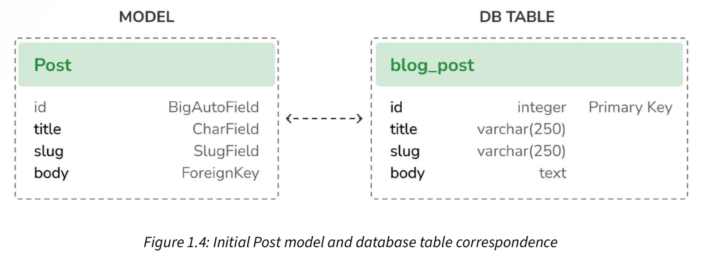

# Models

In Django models are used to define the structure of the database. The models and field will be translated into SQL and used to create the database.

[][1]

[1]: https://djangobyexample.com/ "Django 4 By Example. Fourth Edition. Build powerful and reliable Python web applications from scratch. Antonio Melé."

## Models Fields

The following are the most common fields used in Django models. For a complete list of fields see the [Django documentation][2].

[2]: https://docs.djangoproject.com/en/5.0/ref/models/fields/ "Django documentation"

### Datetime fields

The DateTimeField field is used to store dates with time. It can store both single dates and date ranges.

```Python hl_lines="4 5 6"
from django.db import models
from django.utils import timezone

class Post(models.Model):
    published_at = models.DateTimeField(default=timezone.now)
    created_at = models.DateTimeField(auto_now_add=timezone.now)
    updated_at = models.DateTimeField(auto_now=True)
```

| Option       | Description                                                                                                                                  |
| ------------ | -------------------------------------------------------------------------------------------------------------------------------------------- |
| auto_now_add | Automatically set the field to now when the object is first created.                                                                         |
| auto_now     | Automatically set the field to now every time the object is saved.                                                                           |
| default      | The default value for the field. This can be a value or a callable object. If callable it will be called every time a new object is created. |

> See [Django `datetimefield`][3] for more information.

[3]: https://docs.djangoproject.com/en/5.0/ref/models/fields/#datetimefield "Django documentation"

### Choice fields

The ChoiceField field is used to store a single value from a list of choices.

```Python
from django.db import models

class Post(models.Model):

    # Define the choices
    class Status(models.TextChoices):
        DRAFT = "DF", "Draft"
        PUBLISHED = "PB", "Published"

    # Define model fields
    content = models.TextField()
    status = models.CharField(
        max_length=2,
        choices=Status.choices,
        default=Status.DRAFT,
    )
```

Using another model to define the choices.

```Python
from django.db import models

class Status(models.Model):
    value = models.CharField(max_length=2)
    label = models.CharField(max_length=10)


class Post(models.Model):
    status_list = list(Status.objects.all().values_list('value', 'label'))
    status = models.CharField(max_length=2, choices=status_list)
```

## Referencing the `User` model - `get_user_model()`

Rather than directly referencing the User, it's recommended to use the [`get_user_model()`][4] method from django.contrib.auth. This method fetches the currently active user model - if a custom user model is defined, it will return that; otherwise, it returns the User.

[4]: https://docs.djangoproject.com/en/5.0/topics/auth/customizing/#django.contrib.auth.get_user_model

## Model Attributes

### unique_for_date

The `unique_for_date` attribute can be used to enforce uniqueness of a field for a given date. For example, if you want to ensure that slug is unique for a given date, you can use the following:

```Python
from django.db import models

Post(models.Model):
    title = models.CharField(max_length=100)
    slug = models.SlugField(unique_for_date='published_at')
    published_at = models.DateTimeField()
```
